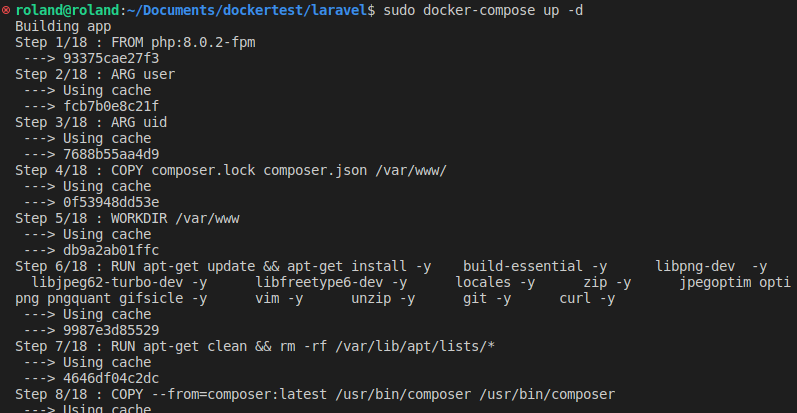

# Laravel-Setup-Using-Docker
## Prerequisites
#### Before you start, you will need;
#### 1. A running ubuntu operating system or you can use a cloud provider 
#### 2. You should have docker installed and running.
#### 3. clone this repository
#### 4. cd into this repo after cloning
#### 5. run this command *docker-compose build app* 
#### 6. then run this command *docker-compose up -d* 
#### 7. run *docker-compose ps* to be sure the three containers are runing
#### 8. run *docker-compose exec app composer install* to install necessary dependencies
#### 9. run *docker-compose exec app php artisan key:generate
#### 10. now open a browser and visit your local host ip or the instance public address

## To break down the process
#### Dockerfile includes instructions that Docker can use to build custom Docker images. It can also install the software required and configure the necessary settings for your application. They specify the environment inside a container that will host your application code. You may push the images you create to docker hub for sharing or place them on other private registries.

#### We will create a Dockerfile that will specify the instructions to build the Laravel application image. Use nano to create the Dockerfile in ~/laravel-web directory:
###        Please checkout the dockerfile in this repo and used it
## What is going in the dockerfile??
#### First, the Dockerfile creates an image on top of the php:8-fpm Docker image. This is a Debian-based image that has the PHP FastCGI implementation PHP-FPM installed. The file also installs the prerequisite packages for Laravel: mcrypt, pdo_mysql, mbstring, and imagick with composer.

#### Creating a dedicated user and group with restricted permissions mitigates the inherent vulnerability when running Docker containers, which run by default as root. Instead of running this container as root, we’ve created the www user, who has read/write access to the /var/www folder thanks to the COPY instruction that we are using with the --chown flag to copy the application folder’s permissions.

#### Finally, the EXPOSE command exposes a port in the container, 9000, for the php-fpm server. CMD specifies the command that should run once the container is created. Here, CMD specifies "php-fpm", which will start the server.

#### Save the file and exit your editor when you are finished making changes.

## step 3 - Let make configuration directory inside our laravel-app 
#### This configuration directory will be called inside our docker-compose file as volumes to mount the dirctory to our containers.  
### 1. PHP Configuratioin Directory
#### To configure PHP, you will create the local.ini file inside the php folder. This is the file that you bind-mounted to /usr/local/etc/php/conf.d/local.ini inside #### the our laravel-app container. Creating this file will allow you to override the default php.ini file that PHP reads when it starts.

### Create the php directory:
          mkdir ~/laravel-app/php
#### next you have nano out the local.ini inside the php directory.
         nano ~/laravel-app/php/local.ini
#### The default php.ini file has an upload limit set to 2M. As an example, we will show you to adjust and set php configurations by changing the value of the allowed #### upload limit, in case you want to upload larger files. Enter the following lines of code inside the file:
        upload_max_filesize=40M
        post_max_size=40M
#### 2. Nginx configuration directory
#### In this step, we will configure Nginx to use the php service we defined earlier. It will use PHP-FPM as the FastCGI server to serve dynamic content. FastCGI server is a software that enables interactive programs to interface with a web server.
#### To configure Nginx, you will create an app.conf file with the service configuration in the ~/laravel-app/nginx/conf.d/ folder.
#### create the nginx/conf.d/ directory
        mkdir -p ~/laravel-app/nginx/conf.d
 #### Next create app.conf configuration file inside you nginx/conf.d directory
         nano ~/laravel-app/nginx/conf.d/app.conf
 #### Add the following line of code insed the app.conf to specify nginx configuration
 
    server {
    listen 80;
    index index.php index.html;
    error_log  /var/log/nginx/error.log;
    access_log /var/log/nginx/access.log;
    root /var/www/public;
    location ~ \.php$ {
        try_files $uri =404;
        fastcgi_split_path_info ^(.+\.php)(/.+)$;
        fastcgi_pass app:9000;
        fastcgi_index index.php;
        include fastcgi_params;
        fastcgi_param SCRIPT_FILENAME $document_root$fastcgi_script_name;
        fastcgi_param PATH_INFO $fastcgi_path_info;
    }
    location / {
        try_files $uri $uri/ /index.php?$query_string;
        gzip_static on;
     }
    }

#### 3. Mysql configuration dirctory
#### To configure MySQL, you will create the my.cnf file in the mysql folder. This is the file that you bind-mounted to /etc/mysql/my.cnf inside the container in Step  This bind mount allows you to override the my.cnf settings as and when required.

#### To demonstrate how this works, we’ll add settings to the my.cnf file that enable the general query log and specify the log file.
#### create mysql directory;
          mkdir ~/laravel-app/mysql
#### Next create a file inside your mysql directory
          nano ~/laravel-app/mysql/my.cnf
#### In the file, add the following code to enable the query log and set the log file location:
          [mysqld]
        general_log = 1
        general_log_file = /var/lib/mysql/general.log
#### This my.cnf file enables logs, defining the general_log setting as 1 to allow general logs. The general_log_file setting specifies where the logs will be stored. save and exit the editor.

#### Step 4 - Modifying Environment Settings and Running the Containers
#### will make a copy of the .env.example file that Laravel includes by default and name the copy .env, which is the file Laravel expects to define its environment:
          cp .env.example .env
#### You can now modify the .env file on the app container to include specific details about your setup.

#### Open the file using nano or your text editor of choice:
         nano .env
#### Find the block that specifies DB_CONNECTION and update it to reflect the specifics of your setup. You will modify the following fields:

##### .DB_HOST will be your db database container.
##### .DB_DATABASE will be the laravel database.
##### .DB_USERNAME will be the username you will use for your database. In this case, we will use laraveluser.
##### .DB_PASSWORD will be the secure password you would like to use for this user account.
#### Save the file and exit your editor.

## Step - 5  Creating the Docker Compose File
#### Docker Compose simplifies the process of setting up and versioning your infrastructure. To set up our Laravel application, we will write a docker-compose file that defines our web server, database, and application services.
### Please checkout my docker compose file code in this repo.
## Note: the volumes inside the docker compose file is used in mounting the configuration files we created in step 3 to our container directory. 
#### With all of your services defined in your docker-compose file, you just need to issue a single command to start all of the containers, create the volumes, and set up and connect the networks:
        sudo docker-compose up -d
        

        
#### When you run docker-compose up for the first time, it will download all of the necessary Docker images, which might take a while. Once the images are downloaded and stored in your local machine, Compose will create your containers. The -d flag daemonizes the process, running your containers in the background.
#### We’ll now use docker-compose exec to set the application key for the Laravel application. The docker-compose exec command allows you to run specific commands in containers.
#### The following command will generate a key and copy it to your .env file, ensuring that your user sessions and encrypted data remain secure:
         sudo docker-compose exec app php artisan key:generate
         sudo docker-compose exec app php artisan config:cache
#### Step - 6 Creating a User for MySQL
#### The default MySQL installation only creates the root administrative account, which has unlimited privileges on the database server. In general, it’s better to avoid using the root administrative account when interacting with the database. Instead, we'll create a dedicated database user for our application’s Laravel database.
#### To create a new user, execute an interactive bash shell on the db container with docker-compose exec:
            sudo docker-compose exec db bash
#### Inside the container, log into the MySQL root administrative account:
         mysql -u root -p
#### You will be prompted for the password you set for the MySQL root account during installation in your docker-compose file.
#### Next, create the user account that will be allowed to access this database. in my case, my username is laravel, though you can replace this with another name if you’d prefer. Just be sure that your username and password here match the details you set in your .env file in the previous step:
           MYSQL> GRANT ALL ON laravel.* TO 'laravel'@'%' IDENTIFIED BY 'your_laravel_db_password';
#### Flush the privileges to notify the MySQL server of the changes:
          MYSQL> FLUSH PRIVILEGES;
#### Then exit mysql and exit your container also
## Step - 7 Migration, composer install and composer update
 #### Run the below commands
        sudo docker-compose exec app composer install
        sudo docker-compose exec app composer update
        sudo docker-compose exec app php artisan migrate
 ## Conclusion
 #### With this README, you will able to setup laravel with docker and understand how to use docker. 
 ## Thank You
